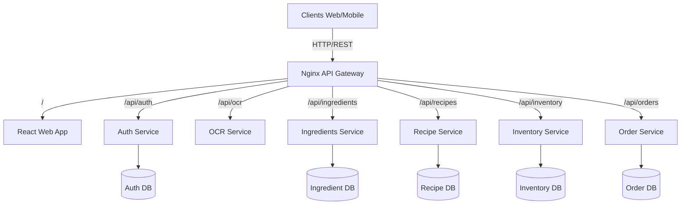

# Scan'n'Eat

**Scan'n'Eat** is a modern microservices-based application designed to revolutionize how users manage their food inventory and discover recipes. By simply scanning receipts or ingredients using OCR technology, users can automatically update their digital pantry and receive personalized recipe suggestions based on what they have in stock.


## 🏗️ Architecture

Scan'n'Eat is built using a microservices architecture, ensuring scalability, maintainability, and separation of concerns. The system is composed of several specialized services communicating via REST APIs, all fronted by an Nginx API Gateway.



## 🛠️ Tech Stack

### Frontend
- **Framework**: React 19 (via Vite)
- **Language**: TypeScript
- **Styling**: TailwindCSS 4.0
- **State Management**: Zustand
- **Routing**: React Router 7

### Backend
- **Core Services**: Java 17, Spring Boot 3.2 (Auth, Order, Setup, Inventory, Recipe)
- **AI/ML Services**: Python 3.9, Flask (OCR Service)
- **Database**: PostgreSQL
- **Gateway**: Nginx

### Infrastructure
- **Containerization**: Docker & Docker Compose
- **Orchestration**: Kubernetes (k8s manifests included)

## 🚀 Getting Started

### Prerequisites
- [Docker Desktop](https://www.docker.com/products/docker-desktop)
- [Node.js 20+](https://nodejs.org/) (for local frontend dev)
- [Java 17+](https://adoptium.net/) (for local backend dev)

### Running with Docker Compose (Recommended)
The easiest way to start the entire system is using Docker Compose.

1. **Clone the repository**
   ```bash
   git clone https://github.com/yourusername/scan-n-eat.git
   cd Scan_n_eat-main
   ```

2. **Start the application**
   ```bash
   docker-compose up --build
   ```

3. **Access the application**
   - **Web App**: [http://localhost:5173](http://localhost:5173) (or port 80 via Nginx)
   - **API Gateway**: [http://localhost:80](http://localhost:80)

## 📦 Services Overview

| Service | Description | Tech | Port (Internal) |
| :--- | :--- | :--- | :--- |
| **Auth Service** | Handles user registration, login, and JWT token management. | Java / Spring Boot | 8080 |
| **OCR Service** | Extracts text from receipt images to identify ingredients. | Python / Flask | 5000 |
| **Order Service** | Manages user orders and transaction history. | Java / Spring Boot | 8080 |
| **Ingredients Service** | Manages the database of available ingredients and nutritional info. | Java / Spring Boot | 8080 |
| **Recipe Service** | Suggests recipes based on user inventory. | Java / Spring Boot | 8080 |
| **Inventory Service** | Tracks the user's current stock of ingredients. | Java / Spring Boot | 8080 |

## 🔧 Configuration

### Environment Variables
Key environment variables are defined in `docker-compose.yaml`. You can customize database credentials and ports there.

- `POSTGRES_USER`: Database user (default: `postgres`)
- `POSTGRES_PASSWORD`: Database password (default: `password`)
- `SPRING_DATASOURCE_URL`: JDBC URL for connecting to the database.

### API Routing
Nginx is configured as a reverse proxy. See `infrastructure/nginx/nginx.conf` for detailed routing rules.
- `/api/v1/oct/*` -> OCR Service
- `/api/v1/auth/*` -> Auth Service
- `/api/v1/orders/*` -> Order Service

## 🤝 Contributing
1. Fork the Project
2. Create your Feature Branch (`git checkout -b feature/AmazingFeature`)
3. Commit your Changes (`git commit -m 'Add some AmazingFeature'`)
4. Push to the Branch (`git push origin feature/AmazingFeature`)
5. Open a Pull Request
